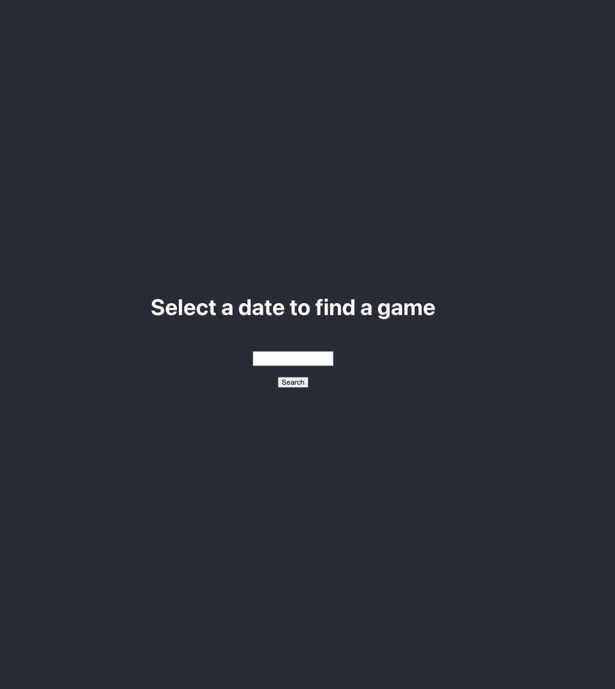
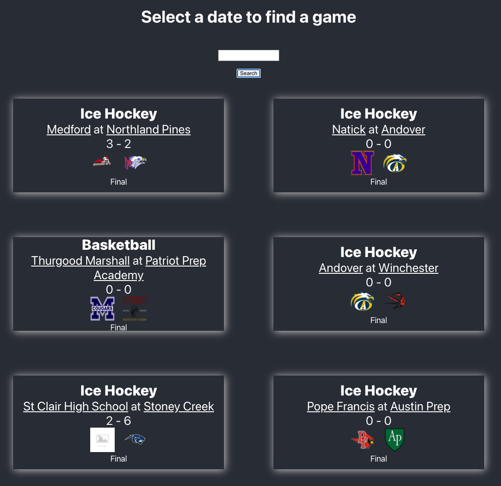

# Score Board 
This app allows you to search for a game by date. 
And view all games and the scores of those games.  
You can also click a team for more information.

 
 
 
 

## Available Scripts

In the project directory, you can run:

### `npm start`

Runs the app in the development mode.\
Open [http://localhost:3000](http://localhost:3000) to view it in your browser.
